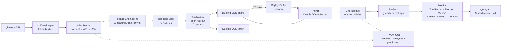
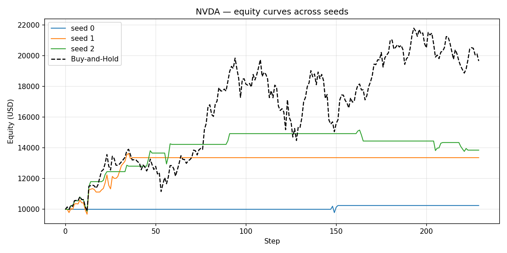
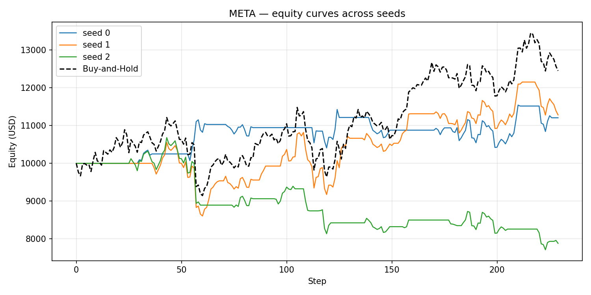
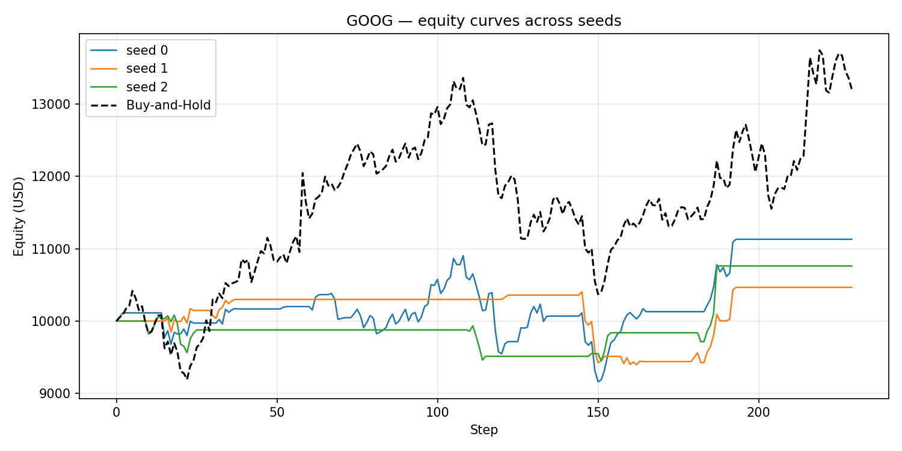
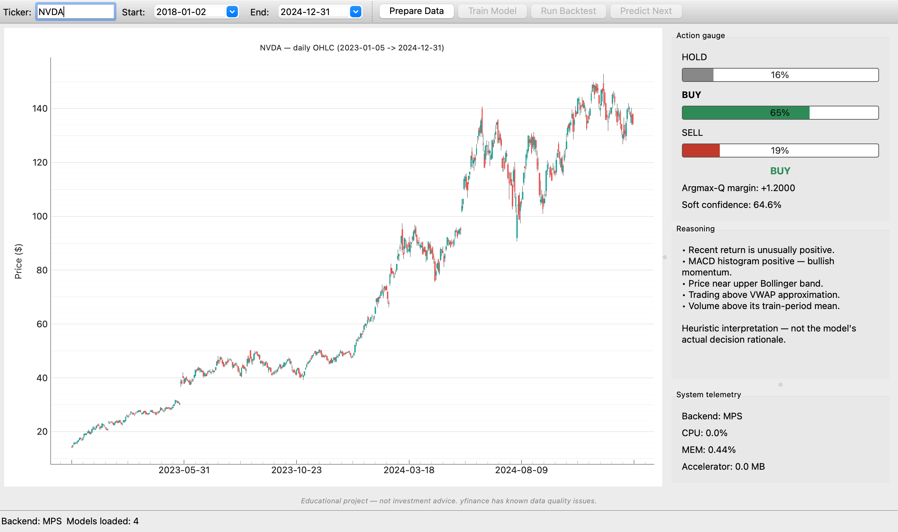
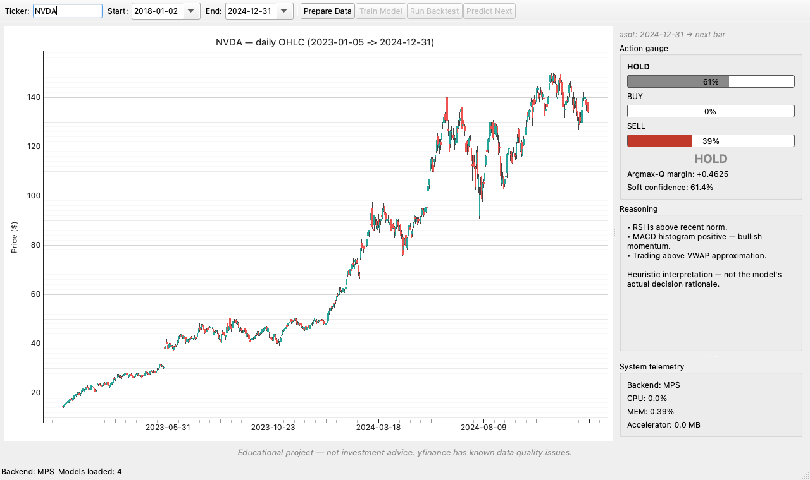
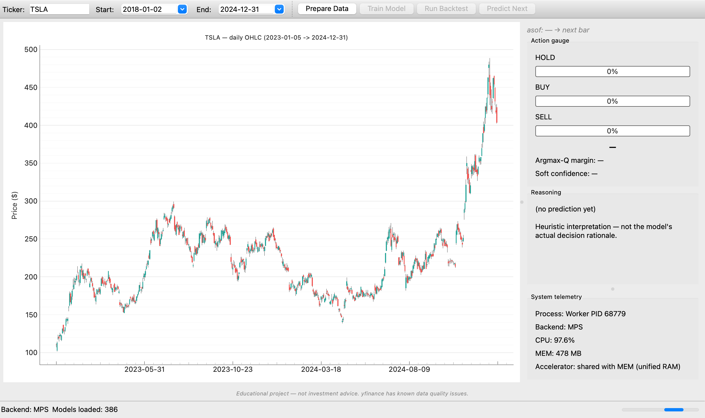
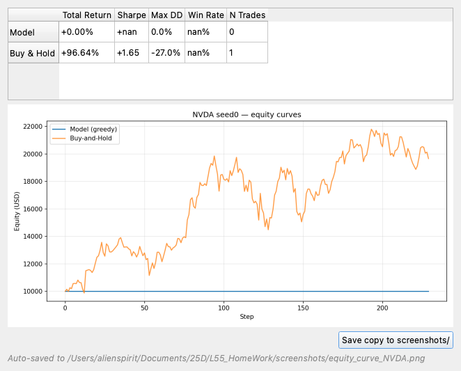

# Dueling DQN Stock Trading

An end-to-end Dueling Double DQN trading agent that learns daily-bar all-in/all-out positions on NVDA, META, and GOOG, with a rate-limited yfinance pipeline, a leak-free 10-feature state representation, a PyQt6 dashboard, and a reproducible 3-seed backtest report.

> **Educational project — not investment advice. yfinance has known data quality issues. Past performance does not guarantee future results.**

---

## Project Schema



The pipeline is strictly one-way: every layer can be exercised on its own from `scripts/`, and the GUI is a thin orchestration shell that imports the same modules used in batch.

---

## Data / Process Flow

**Ingestion.** A single `ApiGatekeeper` (token bucket: 10 req/min, 100 req/hr, 2 concurrent, burst 5 / 10 s) sits in front of yfinance. The fetcher follows a 3-tier strategy: (1) read the per-ticker parquet cache at `data/raw/{ticker}.parquet` if present and fresh (24 h TTL); (2) call yfinance through the gatekeeper, write the result back to parquet; (3) if the API fails for any reason, fall back to the offline CSV in `input/{ticker}.csv` which ships in this repo.

**Feature engineering.** From OHLCV we build a 10-feature state per timestep: 8 market indicators (`log_return`, `rsi_14`, `macd`, `macd_signal`, `macd_hist`, `bbp`, `vwap_dist`, `volume_norm`) and 2 agent features injected by the environment at step time (`position_flag`, `unrealized_pnl_pct`). The dataset is split temporally 70 / 15 / 15 (train / val / test). The volume normalizer is **fit on the train slice only** and applied to val/test — verified by a dedicated leak test.

**RL loop.** `TradingEnv` exposes a `gymnasium`-style API with `Discrete(3)` actions (Hold / Buy / Sell), all-in / all-out sizing, next-bar-open execution to avoid intra-bar look-ahead, and a 10 bps transaction cost on every Buy and Sell. The reward is the change in mark-to-market unrealized PnL minus fees paid on the current tick. The Dueling DQN aggregates `Q = V + (A − mean(A))`, trained with Double DQN targets, uniform replay (100 k), Huber loss, Adam (1e-4), a linear ε-schedule (1.0 → 0.05 over 50 k steps), and a hard target sync every 1 000 steps. Each ticker is trained for 200 000 environment steps across 3 independent seeds; results are aggregated to mean ± std.

---

## Theory

This project layers three ideas on top of vanilla Q-learning. Each one fixes a specific failure mode of the previous step.

### DQN (Deep Q-Network)

Q-learning learns an **action-value function** `Q(s, a)` — the expected discounted sum of future rewards if the agent takes action `a` in state `s` and then follows its current policy. The optimal policy is then simply "in each state, pick the action with the highest Q". Classical Q-learning stores Q in a table, which is impossible when the state is a vector of 10 continuous features.

**DQN** (Mnih et al., 2013/2015, the Atari paper) replaces the table with a neural network `Q_θ(s, a)` and trains it on the Bellman equation:

```
y  =  r + γ · max_{a'} Q_θ⁻(s', a')
loss = ( Q_θ(s, a) − y )²
```

Two stabilization tricks make it actually work:

- **Replay buffer.** Past transitions `(s, a, r, s')` are stored and minibatches are sampled uniformly at random. This breaks the temporal correlation of consecutive states, which otherwise destabilizes SGD.
- **Target network.** A frozen copy `Q_θ⁻` of the online network is used to compute `y`. Without it, the target moves every gradient step and the loss can never settle. In this project the target is hard-synced from the online weights every 1 000 steps.

For exploration we use **ε-greedy**: with probability ε pick a random action, otherwise pick `argmax_a Q(s, a)`. ε is annealed linearly from 1.0 down to 0.05 over the first 50 k steps.

### Double DQN

Plain DQN systematically **overestimates** Q-values. The reason is the `max` operator in the target: noisy positive estimates get selected, noisy negative ones get discarded, and the bias accumulates.

**Double DQN** (van Hasselt, Guez, Silver, 2016) decouples *action selection* from *action evaluation*:

```
a*   =  argmax_{a'} Q_θ(s', a')          ← online net picks the action
y    =  r + γ · Q_θ⁻(s', a*)             ← target net scores it
```

The online network chooses which next action to bootstrap from; the target network estimates its value. Because the two networks are not perfectly correlated, their errors largely cancel and the overestimation shrinks. In trading this matters specifically because we don't want an inflated Q for "Buy" to convince the agent it's safe to enter a falling market.

### Dueling DQN

In many states, *what action you take barely matters* — for example, in the middle of a strong trend with no position, every action looks roughly the same. Vanilla DQN still has to estimate every `Q(s, a)` independently, which wastes capacity.

**Dueling DQN** (Wang et al., 2016) splits the network into two heads after a shared trunk:

- a **value head** `V(s)` — how good is this state, regardless of action?
- an **advantage head** `A(s, a)` — how much better is action `a` than average?

These are combined into Q with a mean-centering term to keep V and A identifiable:

```
Q(s, a) = V(s) + ( A(s, a) − mean_{a'} A(s, a') )
```

The value head can learn the global "is this a good market to be in" signal once, instead of being implicitly re-learned inside every action's Q. The result is faster, more stable learning, especially in environments — like ours — where most steps are Hold.

The combination used here is therefore **Dueling architecture + Double DQN target + uniform replay + Huber loss**, which is the standard "Rainbow without the bells and whistles" baseline.

---

## Metrics — definitions

All metrics below are computed on **daily** mark-to-market equity over the held-out test split. Let `r_t` be the simple daily return of the strategy on day `t` (after fees), and let `E_t` be the equity curve.

| Metric | Formula | What it tells you |
|---|---|---|
| **Total Return** | `E_end / E_start − 1` | Cumulative profit/loss in percent. The headline number, but it tells you nothing about *how* it was earned. |
| **Sharpe ratio** | `mean(r_t) / std(r_t) · √252` | Risk-adjusted return: excess return per unit of volatility. Annualized (see below). Rule of thumb: > 1 is acceptable, > 2 is good, > 3 is excellent (and probably overfit). |
| **Max Drawdown (MaxDD)** | `min_t ( E_t / max_{s ≤ t} E_s − 1 )` | The deepest peak-to-trough loss the strategy would have made you sit through. Closer to 0 is better; −20% means at the worst point your account was down 20% from its previous high. |
| **Sortino ratio** | `mean(r_t) / downside_std(r_t) · √252` (where `downside_std` uses only days with `r_t < 0`) | Like Sharpe, but only the *downside* volatility goes in the denominator. Upside swings stop being "penalized" as risk. Higher than Sharpe by construction when returns are right-skewed. |
| **Calmar ratio** | `annualized return / |MaxDD|` | Return per unit of worst-case loss. A direct answer to "how much did I earn for the pain I had to endure?" |
| **Turnover** | `sum of traded notional / average equity` | How often the agent flips between in-market and out-of-market. High turnover ⇒ fees eat the edge. Our 10 bps cost makes this metric matter. |
| **Win rate** | `# profitable round-trips / # round-trips` | Fraction of completed Buy→Sell cycles that closed at a profit. Doesn't capture trade size, so always read it next to total return. |

"Mean ± std" in the results table is taken **across the 3 seeds**, not across days — i.e. we compute each metric once per seed, then summarize.

---

## Setup

Requires Python 3.12 (locked — not 3.14: `pandas_ta` wheels are not yet stable there). Apple Silicon MPS is detected automatically; CUDA is also supported; otherwise the trainer falls back to CPU.

```bash
python3.12 -m venv venv
source venv/bin/activate
pip install --upgrade pip
pip install -r requirements.txt
```

Sanity check:

```bash
python -c "import torch; print('mps:', torch.backends.mps.is_available(), 'cuda:', torch.cuda.is_available())"
```

**Offline mode.** The repo ships read-only sample CSVs in `input/` (NVDA, META, GOOG, 2018-01-02 → 2024-12-31). The full pipeline runs without any network access — Tier 3 is exercised by the test suite (`test_tier3_csv_fallback_on_yfinance_failure`).

---

## How to Run

The canonical workflow on a single ticker:

```bash
# 1. Prepare data: fetch + cache + features + temporal split
python scripts/prepare_data.py --ticker NVDA --start 2018-01-02 --end 2024-12-31

# 2. Run the full experiment: 3 seeds × 200k steps, then aggregate (~22 min/seed on M4 Pro MPS)
python scripts/run_experiment.py --ticker NVDA

# 3. Backtest a specific checkpoint against buy-and-hold
python scripts/backtest.py --model output/models/NVDA/seed0/NVDA_seed0_latest.pt --ticker NVDA

# 4. Launch the GUI with the latest checkpoint pre-loaded
python scripts/run_gui.py --ticker NVDA --autoload
```

Live training curves:

```bash
tensorboard --logdir output/runs/
```

Single-seed training (useful for iteration):

```bash
python scripts/train.py --ticker NVDA --seed 0
```

---

## Results

All numbers are over the held-out **test split (15%)**, 3 independent seeds (0, 1, 2), with 10 bps round-trip transaction costs applied to both the model and the buy-and-hold benchmark. Sharpe is annualized at √252.

**Unpacking that sentence:**

- **Held-out test split (15%).** The 7-year history (2018-01-02 → 2024-12-31) is cut **temporally** into 70% train / 15% validation / 15% test. The test slice is the most recent ~10–11 months of each ticker and the agent never sees it during training. No shuffling — that would leak the future into the past. Every metric in the table comes from this untouched tail.
- **3 independent seeds (0, 1, 2).** A single DQN run is noisy: replay sampling, network init, ε-greedy exploration, and MPS float nondeterminism all inject randomness. We train the *same* recipe three times with `seed ∈ {0, 1, 2}`, compute metrics on each, and report **mean ± standard deviation across the three seeds**. This is what lets us tell signal from noise.
- **10 bps round-trip transaction costs.** "bp" = basis point = 0.01%. So 10 bps = 0.10%. "Round-trip" means the full Buy-then-Sell cycle. In our implementation it's modelled as **5 bps per side** — 0.05% deducted on every Buy and 0.05% on every Sell — which represents the realistic cost of trading a liquid US stock through a retail broker (broker fee + bid-ask spread + slippage). The same 10 bps is applied to the buy-and-hold benchmark (one Buy at the start of the test window, one Sell at the end), so the comparison stays fair: both strategies pay to enter and exit.
- **Buy-and-hold benchmark.** This is the most basic possible "strategy": on the first day of the test split, buy the stock with all the cash; do nothing until the last day; then sell. It is *the* standard baseline in quantitative finance — an actively managed strategy that doesn't beat buy-and-hold on a **risk-adjusted basis** is not earning its keep, because anyone could have replicated the benchmark by clicking Buy once and going on vacation. In this project the benchmark is computed in `src/evaluation/` from the same test-split price series the agent is evaluated on; there is no external index involved.
- **Sharpe is annualized at √252.** Our returns are **daily**. The raw Sharpe `mean(r_t) / std(r_t)` is therefore a *daily* number and is hard to compare against industry conventions, which quote Sharpe per *year*. Annualization scales daily Sharpe by `√(trading days per year)`. The US stock market is open ≈ 252 days a year (365 minus weekends and ~10 federal holidays), hence the factor `√252 ≈ 15.87`. The square root (not a plain factor of 252) comes from how variance composes over time: if daily returns are roughly i.i.d., variance scales linearly with the number of days, so standard deviation scales with the square root. Mean return scales linearly. Their ratio therefore picks up a factor of `n / √n = √n`. Plug in `n = 252` and you get the convention every quant desk uses.

| Ticker | Model Total Return | Model Sharpe | Model Max DD | Benchmark Total Return | Benchmark Sharpe | Benchmark Max DD |
|---|---|---|---|---|---|---|
| **NVDA** | **+24.9% ± 19.6%** | **1.19 ± 0.63** | **−7.3% ± 2.8%** | +96.6% | 1.65 | −27.0% |
| **META** | +1.2% ± 19.4% | 0.09 ± 1.08 | −18.3% ± 9.5% | +24.5% | 0.94 | −18.4% |
| **GOOG** | +7.9% ± 3.3% | 0.74 ± 0.16 | −10.7% ± 4.9% | +32.1% | 1.25 | −22.4% |

Per-seed equity curves vs benchmark (test split):







### Per-ticker interpretation

**NVDA — risk-adjusted outperformance, absolute underperformance.** The agent earns roughly a quarter of the benchmark return but with about a quarter of its drawdown (−7.3% vs −27.0%). Sharpe (1.19 vs 1.65) is in the same neighbourhood as buy-and-hold, and the win rate is **90% ± 17%** — the agent picks fewer, higher-conviction trades. The PRD target of Sharpe > 1.0 is met on average.

**META — broke even with high variance.** Mean return is essentially zero (+1.2%) and the per-seed spread is enormous: +12.0%, +12.8%, −21.2%. Drawdowns match the benchmark (−18.3% vs −18.4%) but without the upside. META's choppy 2023–2024 price action was too noisy for the current reward signal to learn a consistent policy.

**GOOG — most stable, modest return.** The smallest per-seed std across all three tickers (±3.3% on return, ±0.16 on Sharpe). Drawdown is roughly half the benchmark's (−10.7% vs −22.4%) but absolute return is a quarter of buy-and-hold. The agent learned a coherent risk-reducing policy; it did not learn to capture the trend.

### GUI

The PyQt6 dashboard wraps the same pipeline as the CLI. Main analytics view, with the candlestick chart on the left and the action gauge / soft-confidence / hardware telemetry / reasoning panel on the right:



Predict-Next: loads the latest checkpoint for the selected ticker, runs forward on the most recent 30-bar window through the latest available close, and shows the recommended action with the asof timestamp:



Live system telemetry follows the actual worker subprocess — here on TSLA during training, the panel shows Worker PID, backend (MPS), real CPU%, resident memory, and the unified-memory accelerator note:



Backtest results dialog (launched from the GUI):



---

## Conclusions and Observations

1. **Single-seed RL results are misleading.** On NVDA the three seeds returned +2.5%, +33.7%, and +38.6%. Quoting any one of them as "the" result would either undersell or oversell the agent by an order of magnitude. Reporting mean ± std across ≥ 3 seeds is mandatory, not optional.
2. **The agent learns risk reduction, not return maximization.** Across all three tickers max drawdown is meaningfully lower than buy-and-hold — for NVDA roughly 4× lower. The reward (Δ unrealized PnL minus fees) plus the all-in/all-out action space tends to push the policy toward Hold-most-of-the-time, which mechanically caps both downside and upside.
3. **Tradability is ticker-dependent.** NVDA's 2022–2024 trending behaviour was the easiest market for the agent. META's chop produced near-zero mean return with the widest per-seed spread. GOOG produced the most stable result — small std, modest return.
4. **PRD Sharpe targets are partially met.** "> 1.0 acceptable, > 2.0 excellent" — only NVDA clears 1.0 on average; META and GOOG do not. None of the three tickers reach the "excellent" bar.
5. **No 2025+ data was seen during training.** Out-of-sample results on truly future data are unknown; the held-out 15% test slice ends with the input CSVs (2024-12-31).

---

## Known Limitations / Out of Scope

- **No live trading, no broker integration, no options, no futures, no multi-asset portfolios, no intraday data.** Daily bars, one ticker at a time.
- **VWAP is a daily-bar approximation:** `(H+L+C)/3` weighted by volume — not true intraday VWAP. Documented in `src/data/features.py`.
- **Volume normalization** uses scalar mean/std fit on the train slice. The `volume_norm_window=60` config field is currently unused and documented as such.
- **No walk-forward validation in v1.** Single 70/15/15 temporal split. Walk-forward is noted as future work.
- **Reward is Δ unrealized PnL − fees**, not a Sharpe-based or differential-Sharpe reward. Different reward shapes would produce different agents.
- **yfinance data has known quality issues** (splits, dividends, missing bars). The 3-ticker offline CSV snapshot is the canonical evaluation surface.
- **"Soft confidence" in the GUI** is `softmax(Q)`. Q-values are not probabilities; the argmax-Q margin (also displayed) is the more honest signal.

---

## Tech Stack

| Component | Version |
|---|---|
| Python | 3.12 |
| PyTorch (MPS / CUDA / CPU) | 2.5.x |
| gymnasium | 0.29.x |
| yfinance | 0.2.x |
| pandas | 2.3.x |
| pandas_ta | 0.4.71b0 |
| numpy | 2.2.x |
| PyQt6 | 6.7.x |
| pyqtgraph / mplfinance | 0.13.x / 0.12.x |
| tensorboard | ≥ 2.18, < 2.21 |
| pyarrow | 18.x |
| pytest | 8.x |

Exact pins live in `requirements.txt`.

---

## Project Structure

```
L55_HomeWork/
├── README.md                  # this file (PM-owned, the deliverable)
├── PRD_Dueling_DQN_Stock_Trading.md
├── PLAN.md                    # implementation plan + locked decisions
├── requirements.txt           # pinned for Python 3.12 / macOS arm64
├── config/
│   ├── default.yaml           # all hyperparameters
│   └── tickers.yaml           # default tickers + date ranges
├── input/                     # READ-ONLY sample CSVs (META, GOOG, NVDA)
├── output/
│   ├── models/{ticker}/seed{n}/   # checkpoints (3.4 MB each)
│   ├── runs/{ticker}/seed{n}/     # TensorBoard event files
│   ├── backtests/                 # per-run metrics JSON + equity.png
│   └── analysis/                  # 3-seed aggregates + summaries
├── screenshots/               # README assets (committed)
├── src/
│   ├── data/      # gatekeeper, fetcher, features, splits
│   ├── env/       # TradingEnv
│   ├── models/    # Dueling DQN (V + A heads, mean-centered aggregation)
│   ├── training/  # replay buffer, Double DQN trainer, multi-seed runner
│   ├── evaluation/  # metrics, greedy backtest, buy-and-hold benchmark
│   ├── gui/       # PyQt6 app, candlestick, analytics, workers
│   └── utils/     # seeding, device detection, config loader
├── scripts/       # prepare_data · train · run_experiment · backtest · run_gui
└── tests/         # 151 tests across all layers
```

---

## Reproducibility Notes

The full QA audit lives at [`output/analysis/qa_audit.md`](output/analysis/qa_audit.md). Headlines:

- **151 / 151 tests pass** in both the project venv and a fresh `python3.12 -m venv` install from `requirements.txt`.
- **Seeded training is bit-exact at 500 steps on MPS.** Two independent `NVDA seed=42` runs produced byte-identical `*_latest.pt` files (MD5 `c7dc1b86191497d61c22b1bca03aa7f9`). Float nondeterminism on MPS may accumulate over longer 200 k-step runs, but seed-based reproducibility is preserved at the training-recipe level — the per-seed metric JSONs are stable across reruns.
- **Tier 3 (offline CSV)** is exercised by the test suite; the full pipeline runs without network access.
- Every checkpoint is saved alongside the config that produced it; every aggregate JSON records its source manifest.

---

## Acknowledgements / Sources

- **Dueling Network Architectures for Deep Reinforcement Learning** — Wang, Schaul, Hessel, van Hasselt, Lanctot, de Freitas (2016). The V + A − mean(A) aggregation.
- **Deep Reinforcement Learning with Double Q-learning** — van Hasselt, Guez, Silver (2016). The target `y = r + γ · Q_target(s', argmax_a Q_online(s', a))`.
- **yfinance** — Yahoo Finance scraping library (Ran Aroussi).
- **pandas_ta** — technical analysis indicators (Kevin Johnson). The 0.4.71b0 beta is what supports Python 3.12 + numpy 2.x.
- Lecture materials for L55 — the course that scoped this assignment.
