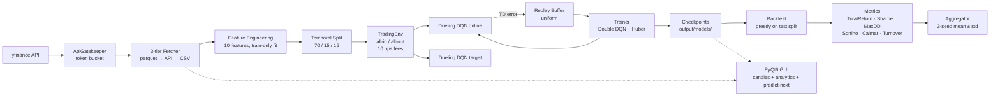

# Dueling DQN Stock Trading

An end-to-end Dueling Double DQN trading agent that learns daily-bar all-in/all-out positions on NVDA, META, and GOOG, with a rate-limited yfinance pipeline, a leak-free 10-feature state representation, a PyQt6 dashboard, and a reproducible 3-seed backtest report.

> **Educational project — not investment advice. yfinance has known data quality issues. Past performance does not guarantee future results.**

---

## Project Schema



The pipeline is strictly one-way: every layer can be exercised on its own from `scripts/`, and the GUI is a thin orchestration shell that imports the same modules used in batch.

---

## Data / Process Flow

**Ingestion.** A single `ApiGatekeeper` (token bucket: 10 req/min, 100 req/hr, 2 concurrent, burst 5 / 10 s) sits in front of yfinance. The fetcher follows a 3-tier strategy: (1) read the per-ticker parquet cache at `data/raw/{ticker}.parquet` if present and fresh (24 h TTL); (2) call yfinance through the gatekeeper, write the result back to parquet; (3) if the API fails for any reason, fall back to the offline CSV in `input/{ticker}.csv` which ships in this repo.

**Feature engineering.** From OHLCV we build a 10-feature state per timestep: 8 market indicators (`log_return`, `rsi_14`, `macd`, `macd_signal`, `macd_hist`, `bbp`, `vwap_dist`, `volume_norm`) and 2 agent features injected by the environment at step time (`position_flag`, `unrealized_pnl_pct`). The dataset is split temporally 70 / 15 / 15 (train / val / test). The volume normalizer is **fit on the train slice only** and applied to val/test — verified by a dedicated leak test.

**RL loop.** `TradingEnv` exposes a `gymnasium`-style API with `Discrete(3)` actions (Hold / Buy / Sell), all-in / all-out sizing, next-bar-open execution to avoid intra-bar look-ahead, and a 10 bps transaction cost on every Buy and Sell. The reward is the change in mark-to-market unrealized PnL minus fees paid on the current tick. The Dueling DQN aggregates `Q = V + (A − mean(A))`, trained with Double DQN targets, uniform replay (100 k), Huber loss, Adam (1e-4), a linear ε-schedule (1.0 → 0.05 over 50 k steps), and a hard target sync every 1 000 steps. Each ticker is trained for 200 000 environment steps across 3 independent seeds; results are aggregated to mean ± std.

---

## Setup

Requires Python 3.12 (locked — not 3.14: `pandas_ta` wheels are not yet stable there). Apple Silicon MPS is detected automatically; CUDA is also supported; otherwise the trainer falls back to CPU.

```bash
python3.12 -m venv venv
source venv/bin/activate
pip install --upgrade pip
pip install -r requirements.txt
```

Sanity check:

```bash
python -c "import torch; print('mps:', torch.backends.mps.is_available(), 'cuda:', torch.cuda.is_available())"
```

**Offline mode.** The repo ships read-only sample CSVs in `input/` (NVDA, META, GOOG, 2018-01-02 → 2024-12-31). The full pipeline runs without any network access — Tier 3 is exercised by the test suite (`test_tier3_csv_fallback_on_yfinance_failure`).

---

## How to Run

The canonical workflow on a single ticker:

```bash
# 1. Prepare data: fetch + cache + features + temporal split
python scripts/prepare_data.py --ticker NVDA --start 2018-01-02 --end 2024-12-31

# 2. Run the full experiment: 3 seeds × 200k steps, then aggregate (~22 min/seed on M4 Pro MPS)
python scripts/run_experiment.py --ticker NVDA

# 3. Backtest a specific checkpoint against buy-and-hold
python scripts/backtest.py --model output/models/NVDA/seed0/NVDA_seed0_latest.pt --ticker NVDA

# 4. Launch the GUI with the latest checkpoint pre-loaded
python scripts/run_gui.py --ticker NVDA --autoload
```

Live training curves:

```bash
tensorboard --logdir output/runs/
```

Single-seed training (useful for iteration):

```bash
python scripts/train.py --ticker NVDA --seed 0
```

---

## Results

All numbers are over the held-out **test split (15%)**, 3 independent seeds (0, 1, 2), with 10 bps round-trip transaction costs applied to both the model and the buy-and-hold benchmark. Sharpe is annualized at √252.

| Ticker | Model Total Return | Model Sharpe | Model Max DD | Benchmark Total Return | Benchmark Sharpe | Benchmark Max DD |
|---|---|---|---|---|---|---|
| **NVDA** | **+24.9% ± 19.6%** | **1.19 ± 0.63** | **−7.3% ± 2.8%** | +96.6% | 1.65 | −27.0% |
| **META** | +1.2% ± 19.4% | 0.09 ± 1.08 | −18.3% ± 9.5% | +24.5% | 0.94 | −18.4% |
| **GOOG** | +7.9% ± 3.3% | 0.74 ± 0.16 | −10.7% ± 4.9% | +32.1% | 1.25 | −22.4% |

Per-seed equity curves vs benchmark (test split):


### Per-ticker interpretation

**NVDA — risk-adjusted outperformance, absolute underperformance.** The agent earns roughly a quarter of the benchmark return but with about a quarter of its drawdown (−7.3% vs −27.0%). Sharpe (1.19 vs 1.65) is in the same neighbourhood as buy-and-hold, and the win rate is **90% ± 17%** — the agent picks fewer, higher-conviction trades. The PRD target of Sharpe > 1.0 is met on average.

**META — broke even with high variance.** Mean return is essentially zero (+1.2%) and the per-seed spread is enormous: +12.0%, +12.8%, −21.2%. Drawdowns match the benchmark (−18.3% vs −18.4%) but without the upside. META's choppy 2023–2024 price action was too noisy for the current reward signal to learn a consistent policy.

**GOOG — most stable, modest return.** The smallest per-seed std across all three tickers (±3.3% on return, ±0.16 on Sharpe). Drawdown is roughly half the benchmark's (−10.7% vs −22.4%) but absolute return is a quarter of buy-and-hold. The agent learned a coherent risk-reducing policy; it did not learn to capture the trend.

### GUI

The PyQt6 dashboard wraps the same pipeline as the CLI. Main analytics view, with the candlestick chart on the left and the action gauge / soft-confidence / hardware telemetry / reasoning panel on the right:


Predict-Next: loads the latest checkpoint for the selected ticker, runs forward on the most recent 30-bar window through the latest available close, and shows the recommended action with the asof timestamp:


Backtest results dialog (launched from the GUI):


---

## Conclusions and Observations

1. **Single-seed RL results are misleading.** On NVDA the three seeds returned +2.5%, +33.7%, and +38.6%. Quoting any one of them as "the" result would either undersell or oversell the agent by an order of magnitude. Reporting mean ± std across ≥ 3 seeds is mandatory, not optional.
2. **The agent learns risk reduction, not return maximization.** Across all three tickers max drawdown is meaningfully lower than buy-and-hold — for NVDA roughly 4× lower. The reward (Δ unrealized PnL minus fees) plus the all-in/all-out action space tends to push the policy toward Hold-most-of-the-time, which mechanically caps both downside and upside.
3. **Tradability is ticker-dependent.** NVDA's 2022–2024 trending behaviour was the easiest market for the agent. META's chop produced near-zero mean return with the widest per-seed spread. GOOG produced the most stable result — small std, modest return.
4. **PRD Sharpe targets are partially met.** "> 1.0 acceptable, > 2.0 excellent" — only NVDA clears 1.0 on average; META and GOOG do not. None of the three tickers reach the "excellent" bar.
5. **No 2025+ data was seen during training.** Out-of-sample results on truly future data are unknown; the held-out 15% test slice ends with the input CSVs (2024-12-31).

---

## Known Limitations / Out of Scope

- **No live trading, no broker integration, no options, no futures, no multi-asset portfolios, no intraday data.** Daily bars, one ticker at a time.
- **VWAP is a daily-bar approximation:** `(H+L+C)/3` weighted by volume — not true intraday VWAP. Documented in `src/data/features.py`.
- **Volume normalization** uses scalar mean/std fit on the train slice. The `volume_norm_window=60` config field is currently unused and documented as such.
- **No walk-forward validation in v1.** Single 70/15/15 temporal split. Walk-forward is noted as future work.
- **Reward is Δ unrealized PnL − fees**, not a Sharpe-based or differential-Sharpe reward. Different reward shapes would produce different agents.
- **yfinance data has known quality issues** (splits, dividends, missing bars). The 3-ticker offline CSV snapshot is the canonical evaluation surface.
- **"Soft confidence" in the GUI** is `softmax(Q)`. Q-values are not probabilities; the argmax-Q margin (also displayed) is the more honest signal.

---

## Tech Stack

| Component | Version |
|---|---|
| Python | 3.12 |
| PyTorch (MPS / CUDA / CPU) | 2.5.x |
| gymnasium | 0.29.x |
| yfinance | 0.2.x |
| pandas | 2.3.x |
| pandas_ta | 0.4.71b0 |
| numpy | 2.2.x |
| PyQt6 | 6.7.x |
| pyqtgraph / mplfinance | 0.13.x / 0.12.x |
| tensorboard | ≥ 2.18, < 2.21 |
| pyarrow | 18.x |
| pytest | 8.x |

Exact pins live in `requirements.txt`.

---

## Project Structure

```
L55_HomeWork/
├── README.md                  # this file (PM-owned, the deliverable)
├── PRD_Dueling_DQN_Stock_Trading.md
├── PLAN.md                    # implementation plan + locked decisions
├── requirements.txt           # pinned for Python 3.12 / macOS arm64
├── config/
│   ├── default.yaml           # all hyperparameters
│   └── tickers.yaml           # default tickers + date ranges
├── input/                     # READ-ONLY sample CSVs (META, GOOG, NVDA)
├── output/
│   ├── models/{ticker}/seed{n}/   # checkpoints (3.4 MB each)
│   ├── runs/{ticker}/seed{n}/     # TensorBoard event files
│   ├── backtests/                 # per-run metrics JSON + equity.png
│   └── analysis/                  # 3-seed aggregates + summaries
├── screenshots/               # README assets (committed)
├── src/
│   ├── data/      # gatekeeper, fetcher, features, splits
│   ├── env/       # TradingEnv
│   ├── models/    # Dueling DQN (V + A heads, mean-centered aggregation)
│   ├── training/  # replay buffer, Double DQN trainer, multi-seed runner
│   ├── evaluation/  # metrics, greedy backtest, buy-and-hold benchmark
│   ├── gui/       # PyQt6 app, candlestick, analytics, workers
│   └── utils/     # seeding, device detection, config loader
├── scripts/       # prepare_data · train · run_experiment · backtest · run_gui
└── tests/         # 151 tests across all layers
```

---

## Reproducibility Notes

The full QA audit lives at [`output/analysis/qa_audit.md`](output/analysis/qa_audit.md). Headlines:

- **151 / 151 tests pass** in both the project venv and a fresh `python3.12 -m venv` install from `requirements.txt`.
- **Seeded training is bit-exact at 500 steps on MPS.** Two independent `NVDA seed=42` runs produced byte-identical `*_latest.pt` files (MD5 `c7dc1b86191497d61c22b1bca03aa7f9`). Float nondeterminism on MPS may accumulate over longer 200 k-step runs, but seed-based reproducibility is preserved at the training-recipe level — the per-seed metric JSONs are stable across reruns.
- **Tier 3 (offline CSV)** is exercised by the test suite; the full pipeline runs without network access.
- Every checkpoint is saved alongside the config that produced it; every aggregate JSON records its source manifest.

---

## Acknowledgements / Sources

- **Dueling Network Architectures for Deep Reinforcement Learning** — Wang, Schaul, Hessel, van Hasselt, Lanctot, de Freitas (2016). The V + A − mean(A) aggregation.
- **Deep Reinforcement Learning with Double Q-learning** — van Hasselt, Guez, Silver (2016). The target `y = r + γ · Q_target(s', argmax_a Q_online(s', a))`.
- **yfinance** — Yahoo Finance scraping library (Ran Aroussi).
- **pandas_ta** — technical analysis indicators (Kevin Johnson). The 0.4.71b0 beta is what supports Python 3.12 + numpy 2.x.
- Lecture materials for L55 — the course that scoped this assignment.
